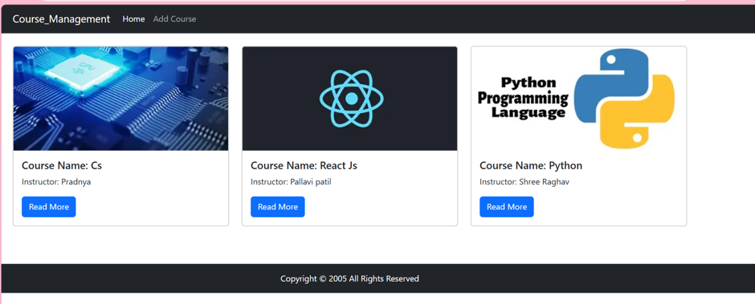
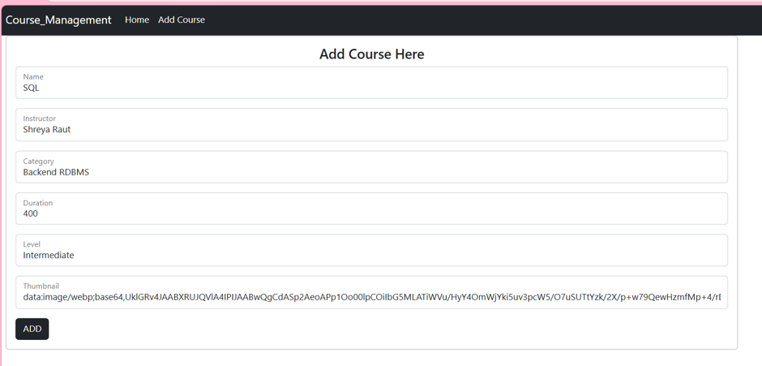
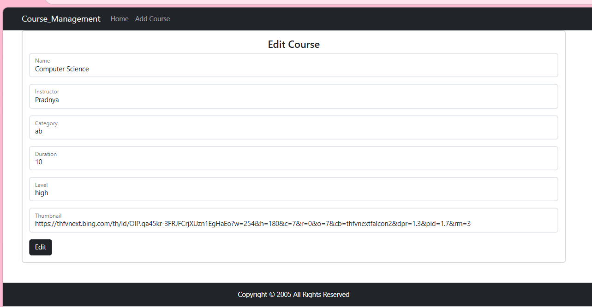
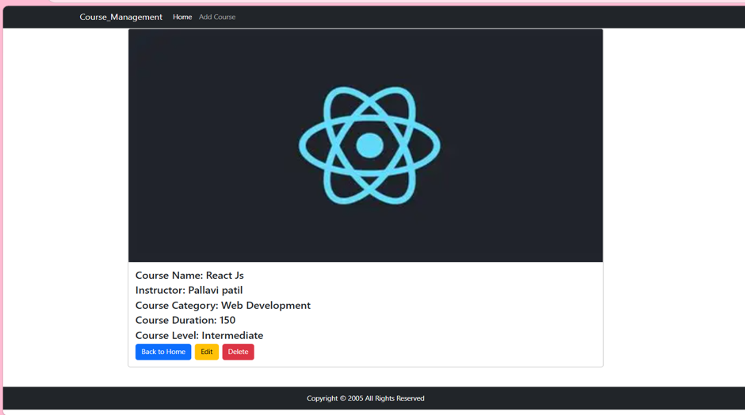

# Course Management System

A MERN Stack Application:- building a Course Management application in ReactJS. The application should allow users to add, view, edit, and delete courses, including a thumbnail image for each course. a.

## Features

- Add Course
- View All Courses
- View Course Details
- Edit Course
- Delete Course

## Technologies Used

### Frontend
- React JS
- React Router DOM
- Bootstrap
- Axios

### Backend
- Node JS
- Express JS
- MongoDB
- Mongoose

## Project Screenshots

### Home Page



### Add Course Page



### Edit Course Page



### Show Course Details Page



## How to Run

### Backend

```bash
cd mern_backend
npm install
npm start
nodemon app.js
```

### Frontend

```bash
cd mern_frontend
npm install
npm run dev
```

## Author

Riddhi Khatate